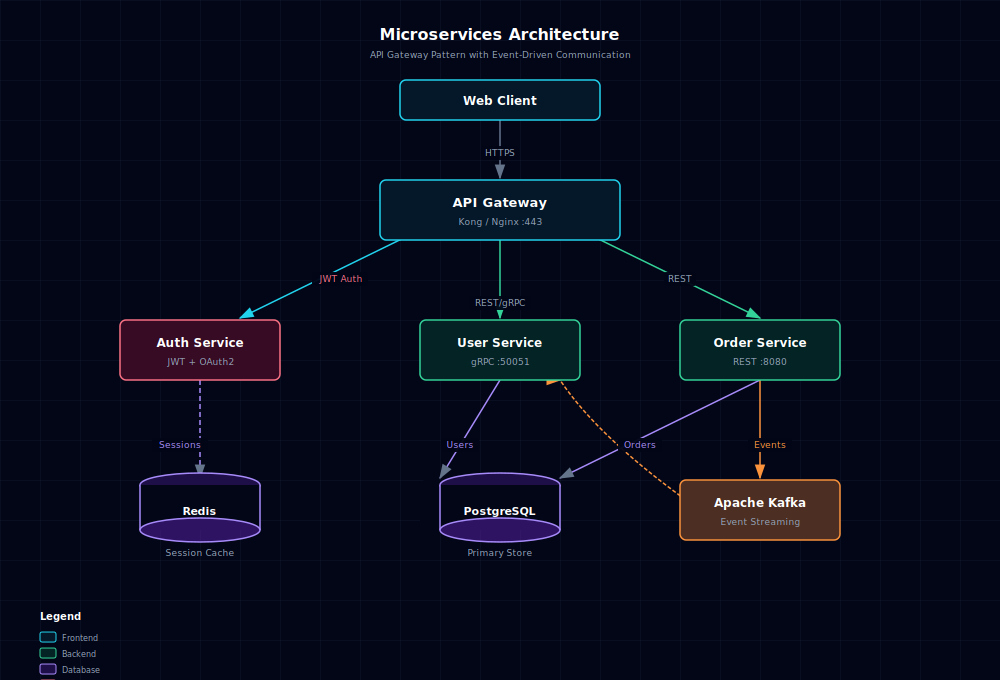
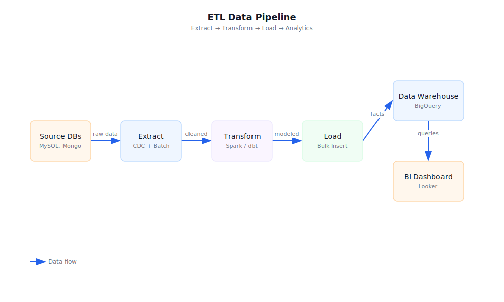
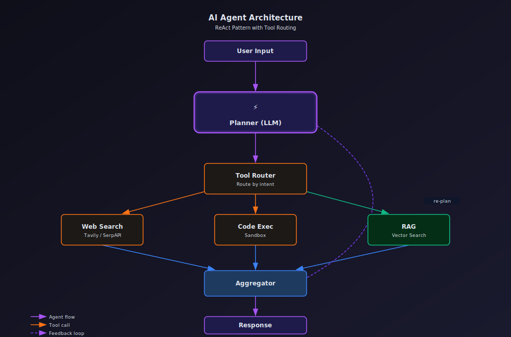
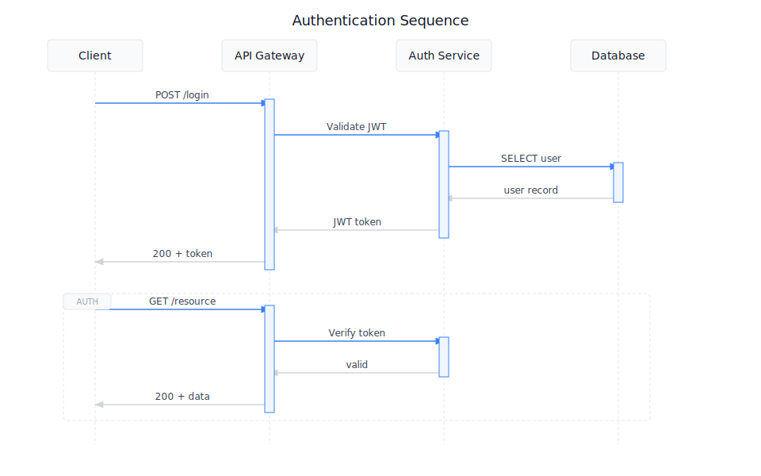
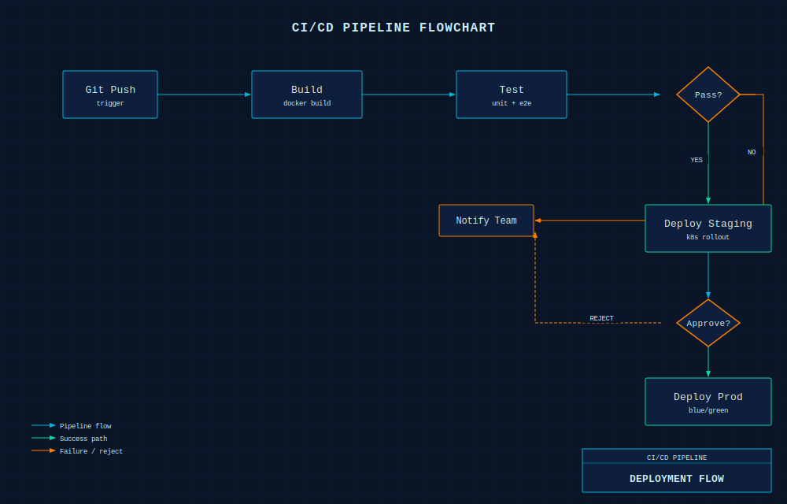

# Tech Diagram

> 🎨 Production-quality technical diagrams from natural language — SVG + PNG or standalone HTML.

An AI agent skill that generates beautiful, accurate technical diagrams. Describe your system architecture, data flow, or process — get a polished SVG ready for docs, presentations, or sharing.

## Features

- **14 diagram types** — Architecture, Data Flow, Flowchart, Sequence, Agent, Memory, Mind Map, Timeline, Comparison, UML (Class/Use Case/State Machine), ER, Network Topology
- **6 visual styles** — From clean documentation to dark terminal aesthetics
- **Dual output** — SVG+PNG (default) for embedding, or self-contained HTML for sharing
- **Smart layout** — Automatic grid snapping, arrow routing, collision avoidance
- **Brand icons** — 60+ product icons (AWS, Kafka, PostgreSQL, OpenAI, etc.) as inline SVG
- **rsvg-convert compatible** — No external font imports; validates and exports cleanly

## Example Gallery

### Architecture — Microservices (Style 6: Cocoon Dark)
API Gateway → Auth, User, Order services → PostgreSQL, Redis, Kafka



### Data Flow — ETL Pipeline (Style 1: Flat Icon)
Source DBs → Extract → Transform → Load → Data Warehouse → BI Dashboard



### Agent Architecture (Style 2: Dark Terminal)
User Input → Planner (LLM) → Tool Router → [Web Search, Code Exec, RAG] → Aggregator → Response



### Sequence — Authentication (Style 4: Notion Clean)
Client ↔ API Gateway ↔ Auth Service ↔ Database — JWT login + token verification



### Flowchart — CI/CD Pipeline (Style 3: Blueprint)
Git Push → Build → Test → Deploy Staging → Approval → Deploy Prod



## Styles

| # | Style | Background | Best For |
|---|-------|-----------|----------|
| 1 | **Flat Icon** | White | Blogs, docs, presentations |
| 2 | **Dark Terminal** | Near-black gradient | GitHub, dev articles |
| 3 | **Blueprint** | Dark navy + grid | Architecture docs, engineering |
| 4 | **Notion Clean** | White, minimal | Notion, wikis, Confluence |
| 5 | **Glassmorphism** | Dark gradient + blur | Product sites, keynotes |
| 6 | **Cocoon Dark** | Slate-950 + grid | Dashboards, shareable HTML |

## Installation

### OpenClaw (recommended)
```bash
clawhub install tech-diagram
```

### Claude Projects / ChatGPT
Upload `SKILL.md` and the `references/` folder to your project knowledge base.

### Manual
```bash
git clone https://github.com/DaleXiao/tech-diagram.git
```

## Usage

Just describe what you want:

> "Draw a microservices architecture with API Gateway, three backend services, PostgreSQL and Redis. Use the dark cocoon style."

> "Create a flowchart for our CI/CD pipeline: push → build → test → deploy staging → approval gate → deploy prod. Blueprint style."

> "Visualize an ETL pipeline from MySQL and MongoDB through Spark transforms into BigQuery."

The skill handles layout, styling, icons, arrow routing, and exports automatically.

## Credits

- **[fireworks-tech-graph](https://github.com/yizhiyanhua-ai/fireworks-tech-graph)** — Style inspiration and SVG patterns
- **[Cocoon AI architecture-diagram-generator](https://github.com/Cocoon-AI/architecture-diagram-generator)** — Cocoon Dark style reference and HTML template design

## License

[MIT](LICENSE)
